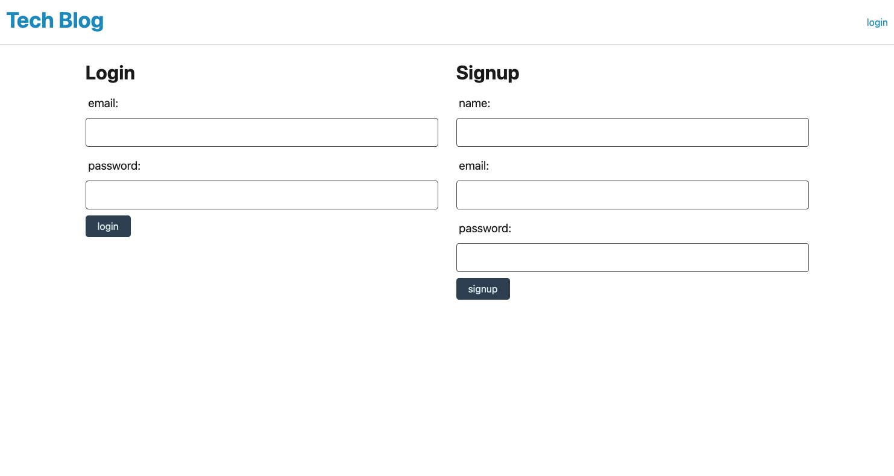

# homework-14
# Tech Blog

### The assignment was to create a tech blog where the user can create and account or login to an existing account, and create posts. Users have to be logged in to create posts. 

## Packages & APIs
### bcrypt, dotenv, mysql2, sequelize, express, express-handlebars, express-session, and connect-session-sequelize were installed for this applicaiton.

## Contributions
### On advice from my tutor, I used the mini project as starter code, modifying it and deleting some to work for this application. I offered that advice to others in the class, and some of us walked through it together. Among those would be James Garinger, Brad O'Dell, probably William Renfroe and Mitchell Robbins, and maybe Chuck Stephens. There may have been others I forgot about. 

## The application has a MIT licence. 

[The applicaiton is deployed here](https://floating-spire-65942.herokuapp.com/login)

